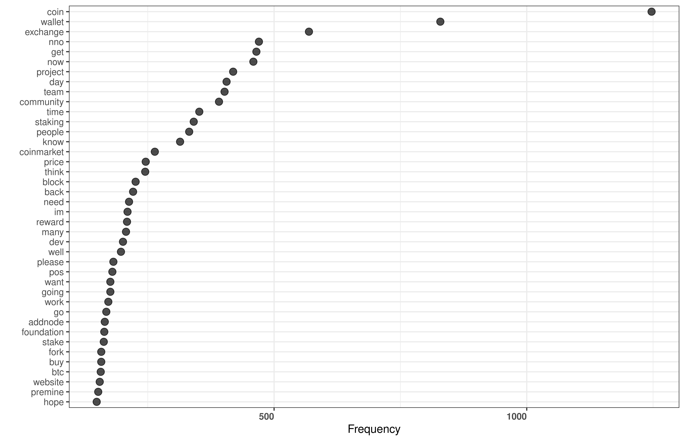
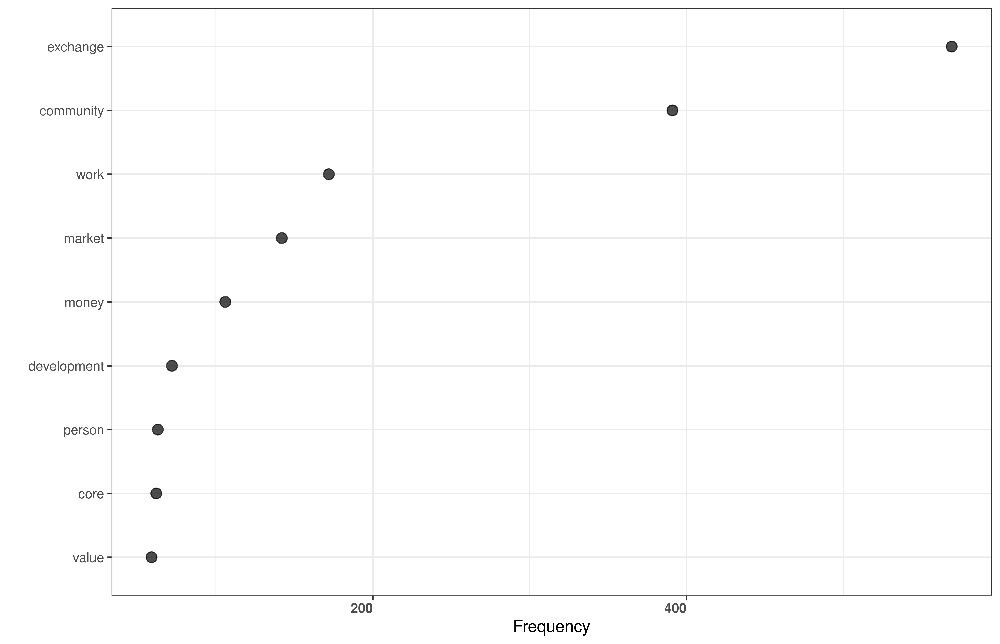

# Electra Thread

**Reference:** Birbil, S.I. and Caliskan, K. (2021). Bitcointalk Electra Forum Discussion Text Corpus 2018-2021. GitHub Repository

https://github.com/sibirbil/ElectraThread

## R Code

If you run the accompanying R code, you will produce the following two figures:

